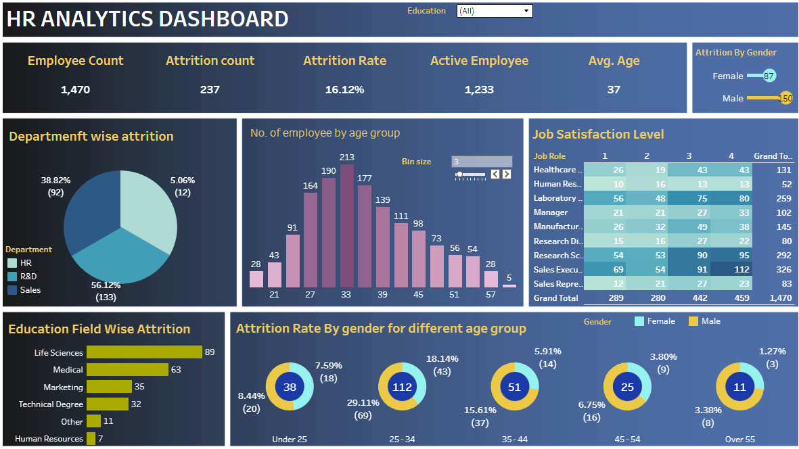

# HR Analytics Dashboard — Tableau

## 📊 Project Overview

This project is an interactive HR Analytics Dashboard developed using Tableau Public.

The dashboard analyzes employee attrition and workforce characteristics across departments, age groups, gender, education fields, and job roles.

The goal of this project is to transform HR data into an interactive and easy-to-understand dashboard that can support workforce and employee-retention analysis.

---

## 🔗 Live Interactive Dashboard

[View the HR Analytics Dashboard on Tableau Public](https://public.tableau.com/app/profile/diwash.upadhyaya/viz/Book1_17860949345270/HRAnalyticsDashboard)

---

## 🖼️ Dashboard Preview

---

## 📌 Key Performance Indicators

| KPI | Value |
|---|---:|
| Total Employees | 1,470 |
| Attrition Count | 237 |
| Attrition Rate | 16.12% |
| Active Employees | 1,233 |
| Average Age | 37 |

---

## 📈 Dashboard Analysis

The dashboard provides analysis of:

- Department-wise employee attrition
- Attrition by gender
- Attrition across different age groups
- Education field-wise attrition
- Employee age-group distribution
- Job satisfaction levels by job role
- Active employees and overall attrition
- Interactive education filtering

---

## 💡 Key Insights

Based on the dashboard:

- The overall employee attrition rate is **16.12%**.
- The dashboard contains **237 attrition cases** among 1,470 employees.
- Sales has the highest department-wise attrition count among the departments shown.
- Life Sciences has the highest attrition count among the education fields shown.
- The **25–34 age group** represents a substantial portion of the analyzed workforce.
- Job satisfaction varies across different job roles and satisfaction levels.

---

## 🛠️ Tools & Technologies

- **Tableau Public** — Dashboard development and visualization
- **Microsoft Excel** — Data preparation
- **Data Visualization** — Interactive charts and KPI analysis
- **HR Analytics** — Employee attrition analysis

---

## 🎯 Project Objectives

The main objectives of this project were to:

1. Analyze employee attrition patterns.
2. Identify differences in attrition across departments.
3. Analyze employee demographics and age groups.
4. Examine attrition by gender and education field.
5. Analyze job satisfaction across different job roles.
6. Present HR metrics through an interactive dashboard.

---

## 📂 Project Files

- `HR Analytics dashboard.twbx` — Tableau packaged workbook
- `image.png` — Dashboard preview
- `README.md` — Project documentation

---

## 📊 Dashboard Features

### KPI Cards
- Employee Count
- Attrition Count
- Attrition Rate
- Active Employees
- Average Age

### Visualizations
- Department-wise Attrition
- Employee Count by Age Group
- Job Satisfaction Level
- Education Field-wise Attrition
- Attrition Rate by Gender and Age Group
- Attrition by Gender

### Interactive Features
- Education filter
- Interactive dashboard visualizations
- Tableau Public dashboard

---

## 👤 Author

**Diwash Upadhyaya**

### Portfolio

- [GitHub](https://github.com/diwashup)
- [Tableau Public](https://public.tableau.com/app/profile/diwash.upadhyaya)

---

⭐ If you found this project useful, feel free to explore the interactive dashboard on Tableau Public.
